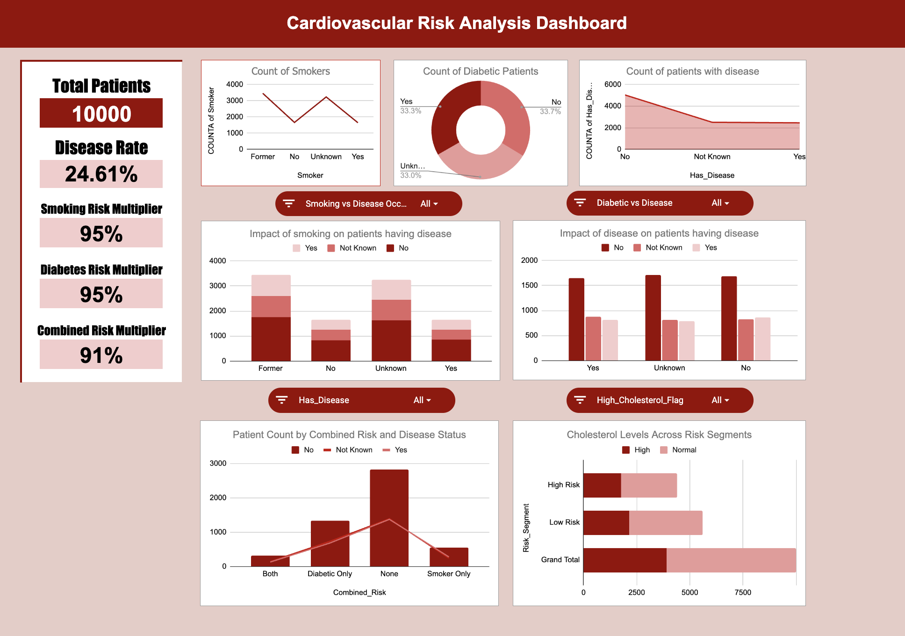

# Cardiovascular Risk Impact Analysis

## Dashboard Preview

  

The dataset is designed for:

- Health Analytics  
- Risk Prediction Modeling  
- Clinical Trend Analysis  
- Exploratory Data Analysis (EDA)  
- Data Cleaning & Validation Practice  

Each row represents one patient record.

---

## Project Overview

The **Patient Health Records Dataset** contains approximately 10000 anonymized patient entries structured for analytical and predictive healthcare use cases.

This dataset enables structured evaluation of relationships between lifestyle factors, chronic conditions, and clinical measurements such as BMI, blood pressure, cholesterol, and heart rate.

It supports data-driven healthcare insights and risk segmentation exercises.

---

## Objectives

- Analyze the relationship between BMI and cholesterol levels  
- Study age-related trends in blood pressure  
- Evaluate diabetes prevalence patterns  
- Assess smoking status in relation to cardiovascular risk  
- Examine medication impact on clinical outcomes  
- Practice real-world healthcare data cleaning and normalization  

---

## Dataset Information

- **Filename:** `patient_health_dataset.csv`  
- **Domain:** Healthcare  
- **Total Records:** ~10000  
- **Primary Key:** `Patient_ID`  
- **Structure:** Each row represents one patient  
- **Tools Used:** Google Sheets, Excel, Python  

---

## Data Dictionary

| Column Name        | Description                                      | Data Type |
|-------------------|--------------------------------------------------|-----------|
| Patient_ID        | Unique patient identifier                        | String |
| Name              | Patient full name                                | String |
| Age               | Age in years                                     | Integer |
| Gender            | Male / Female / Unknown                          | Categorical |
| City              | Standardized city names                          | Categorical |
| BMI               | Body Mass Index                                  | Float |
| Systolic_BP       | Systolic (upper) blood pressure                  | Integer |
| Diastolic_BP      | Diastolic (lower) blood pressure                 | Integer |
| Heart_Rate        | Heart rate (beats per minute)                    | Integer |
| Cholesterol_Level | Cholesterol measurement                          | Integer |
| Diabetic          | Diabetes status (Yes/No/Unknown)                 | Categorical |
| Smoking_Status    | Smoking status (Yes/No/Former/Unknown)           | Categorical |
| Medications       | Prescribed medications                           | String |
| Last_Visit_Date   | Date of most recent clinical visit               | Date |
| Follow_Up         | Days until next scheduled visit                  | Integer |

---

## Data Cleaning & Preparation

- Standardized inconsistent categorical values (Gender, Smoking_Status, Diabetic)  
- Normalized city names  
- Converted date formats to standard format  
- Separated blood pressure into Systolic and Diastolic components  
- Removed unit annotations from BMI  
- Handled missing values with sensible defaults  
- Verified valid numerical ranges for medical metrics  
- Ensured numeric consistency for analysis and pivot tables  

---

## Key Dataset Statistics

| Metric | Value |
|--------|--------|
| Average Age | 34 years |
| Most Common City | New York |
| Diabetes Prevalence | 28% |
| Average BMI | 22.4 |
| Most Common BP Reading | 120/80 |

---

## Suggested Analyses

### 1. BMI vs Cholesterol Correlation  
Analyze whether higher BMI values are associated with elevated cholesterol levels.

### 2. Smoking & Heart Health  
Compare heart rate and blood pressure across smoking categories.

### 3. Age vs Blood Pressure Trend  
Study how systolic and diastolic pressure change across age groups.

### 4. Diabetes Risk Segmentation  
Identify demographic and clinical differences between diabetic and non-diabetic patients.

### 5. Medication Impact Study  
Evaluate how prescribed medications correlate with cholesterol and blood pressure readings.

---

## Potential KPIs

- Hypertension Rate (BP > 140/90)  
- Average BMI by City  
- Diabetes Rate by Age Group  
- Smoking Distribution (%)  
- Average Cholesterol Level  
- Average Follow-Up Interval  

---

## Applications

- Healthcare Dashboard Development  
- Exploratory Data Analysis (EDA)  
- Machine Learning Classification (Diabetes Prediction)  
- Regression Modeling (Cholesterol / BP Prediction)  
- Academic Projects  
- Capstone or Portfolio Projects  

---

## Limitations

- Anonymized dataset (no personally identifiable information)  
- No long-term health outcome tracking  
- No medication dosage details  
- No hospitalization or diagnosis history beyond diabetes indicator  
- Cross-sectional dataset (limited time-series analysis)  

---

## Conclusion

The **Patient Health Records Dataset** provides a structured healthcare dataset suitable for analytical, visualization, and predictive modeling projects.

It enables meaningful exploration of relationships between lifestyle factors, chronic conditions, and clinical metrics - forming a strong foundation for healthcare data analytics and applied machine learning projects.
 
